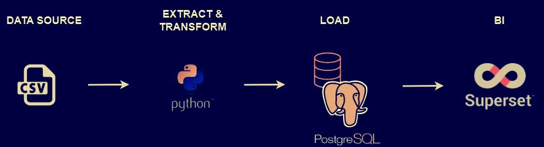

# Restaurant Business Analytics with Apache Superset

# Project Purpose
This project focuses on developing a data visualization solution for a Colombian restaurant business with two locations. The goal is to provide stakeholders with clear and insightful reports through Apache Superset, ensuring data-driven decision-making.

##  Two dashboards are created and updated monthly:

### I. Monthly Sales & Expenses Dashboard – Offers a detailed view of the restaurant's financial performance for the current month, including:

- Total monthly sales (both locations combined, big number chart).
- Daily sales trends for both locations (line chart).
- Sales distribution for Location "93" by cost centers (pie chart).
- Sales split between restaurant and delivery provider "Rappi" (pie chart).
- Costs and expenses breakdown per location (tables).

### II. Quarterly Business Overview Dashboard – Provides a three-month performance analysis with:

- Total sales for the three months (both locations combined, big number chart).
- Sales breakdown by location (bar chart).
- Monthly sales trends for both locations (line chart).
- Daily sales per week per location (heatmap calendar charts).
- Payment method distribution (cash vs. card, pie charts).
- Costs and expenses breakdown for each location (tables with separate columns for each month).


# Apache Superset Setup and Dashboard Creation Guide
## 1. Install and Run Apache Superset
1.1 Change to Linux Mode (WSL)
```
wsl
```
1.2 Pull Apache Superset
```
docker pull apache/superset
```
1.3 Run Superset Container
```
docker exec -it superset bash
```
1.4 Initialize Superset Database
```
superset db upgrade
```
1.5 Create an Admin User
```
superset fab create-admin
```
🔹 Provide the required details (Username, Name, Email, Password).

1.6 Exit the Container
```
exit
```
1.7 Access Superset in Browser <br>
🔹 Open http://localhost:8088 <br>
🔹 Log in with the admin credentials created earlier.

## 2. Start PostgreSQL
2.1 Open PostgreSQL Installation Folder
```
cd "C:\Program Files\PostgreSQL\16\bin"
```
(Replace 16 with your version.)

2.2 Log in as Postgres User
```
psql -U postgres
```
2.3 Reset Password
```
ALTER USER postgres WITH PASSWORD 'newpassword';
```
(Replace 'newpassword' with a secure password.)

2.4 Exit PostgreSQL
```
\q
```
2.5 Verify PostgreSQL is Running
```
netstat -ano | findstr :5432
```
🔹 If no output appears, start PostgreSQL manually:

```
net start postgresql-x64-16
```
(Adjust 16 to your version.)

2.6 Connect to PostgreSQL and List Databases
```
psql -U postgres
\l
```
## 3. Connect Superset to PostgreSQL
3.1 Open Superset in Browser <br>
🔹 http://localhost:8088 → Log in

3.2 Add a New Database Connection <br>
🔹 Click Settings (gear icon) → Database Connections <br>
🔹 Click ➕ Add Database → Select PostgreSQL

3.3 Configure Connection
🔹 Scroll to SQLAlchemy URI Connection and enter:
```
postgresql://postgres:<password>@localhost:5432/<database>
```
(Replace <password> and <database> with actual values.) <br>

🔹 Click Test Connection → If successful, click Connect.

## 4. Upload CSV Data to PostgreSQL
4.1 Connect to PostgreSQL
```
psql -U postgres -d your_database
```
(Replace your_database with the actual database name.)

4.2 Create 4 tables (the SQL code for table creation is stored in the 'SQL code' folder): `ventas`, `local_93`, `costo_gasto_93`, `costo_gasto_uni`

4.3 Exit Database
```
\q
```
4.4 Import 4 CSV files into the tables in Postgres (the CSV files are stored in the 'CSV files' folder)
```
psql -U your_username -d your_database -c "\copy ventas(local, fecha, efectivo, bbva, rappi, davivienda) FROM 'C:/path/to/ventas.csv' WITH CSV HEADER NULL '' DELIMITER ',';"
```
(Replace: your_username → PostgreSQL username, your_database → Database name)

C:/path/to/ventas.csv → Full path to CSV

4.5 Verify Imported Data
```
psql -U your_username -d your_database -c "SELECT * FROM ventas LIMIT 10;"
```
4.6 Update Data in PostgreSQL <br>
🔹 Only insert new rows when updating.

4.7 Create Temporary Table
```
CREATE TABLE temp_table AS SELECT * FROM ventas LIMIT 0;
```
4.8 Copy Updated Data
```
psql -U postgres -d test -c "\copy temp_table(id, local, fecha, efectivo, bbva, rappi, davivienda) FROM 'C:/Users/annav/Documents/DE/Superset/ventas.csv' WITH CSV HEADER NULL '' DELIMITER ',';"
```
4.9 Insert New Rows into Main Table <br>
🔹 Use INSERT INTO ventas with NOT EXISTS to avoid duplicates.

## 5. Create Dashboards in Apache Superset
5.1 Create a Dataset <br>
🔹 SQL → SQL Lab → Add a new tab <br>
🔹 Select Database → Schema → Table

5.2 Write and Run SQL Query <br>
🔹 Enter your SQL query → Click Run <br>
🔹 Review the Results Table

5.3 Save Query as Dataset <br>
🔹 Click ▼ Save → Save dataset <br>
🔹 Enter a dataset name → Click Save & Explore

5.4 Create a Chart <br>
🔹 Choose a chart type (bar chart, pie chart, etc.) <br>
🔹 Configure settings & apply filters

5.5 Create a Dashboard <br>
🔹 Open Superset in a new tab <br>
🔹 Go to Dashboards → + Dashboard → Enter a name → Save

5.6 Save and Add Charts to Dashboard <br>
🔹 Go back to the chart tab <br>
🔹 Click Save → Add to Dashboard <br>
🔹 Select the Dashboard name → Click Save & Go to Dashboard

5.7 Customize the Dashboard <br>
🔹 Arrange charts, add filters, change layout

5.8 Export Dashboard as PDF <br>
🔹 Open Dashboard → Click ... → Download → Export to PDF

## 6. Stop Apache Superset Container
```
docker stop d732306c7312
```
(Replace d732306c7312 with your actual CONTAINER ID from `docker ps`)
